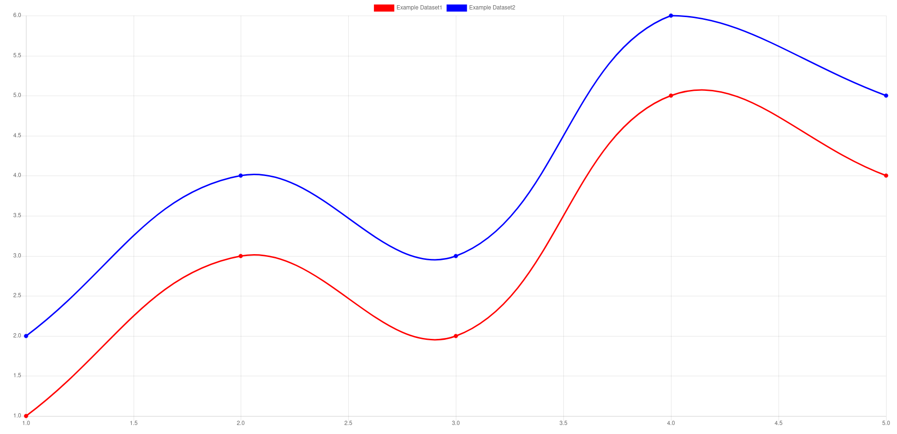

# chartpy
chartpy lets you manage charts in your Flask application.

This is compatible with Chart.js


Getting Started
===============
Install flask with command below or with requirments folder:

    pip install flask

Clone this project and add it to your directory. 

Using it
========

A simple Line Chart example.

# 1. Create the HTML file
```
<canvas id="myChart"></canvas>

	<script type="text/javascript">
		data = {{ChartObj.toJson()|safe}};
		window.myLineChart =new Chart(document.getElementById("myChart"),data);
	</script>

```
    
# 2. Create the chart in python

```
from app import app
from flask import render_template
from chartpy import Scatter, Histogram, Line

@app.route('/')
@app.route('/index')
def index():
	ScatChart=Scatter()
	ScatChart.AddDataSet(label="Example Dataset1", xdata=[1,2,3,4,5], ydata=[10,20,10,11,13], color="red")
	ScatChart.AddDataSet(label="Example Dataset2", xdata=[1,2,3,4,5], ydata=[15,25,15,16,8], color="blue")
	return render_template('example.html', ChartObj=ScatChart)
```

# 3. Get a Chart.js Line Chart



 
I find this much more convient than using the javascript.

An example of how to do it is attached with the app.

To run it all you need to do is install and run 
"flask run"

# FUTRUE PLANS
I plan on adding more chart options other than the scatter plot. Feel free to add your own favorite charts.

Check out https://github.com/chartjs/Chart.js and support that project!
